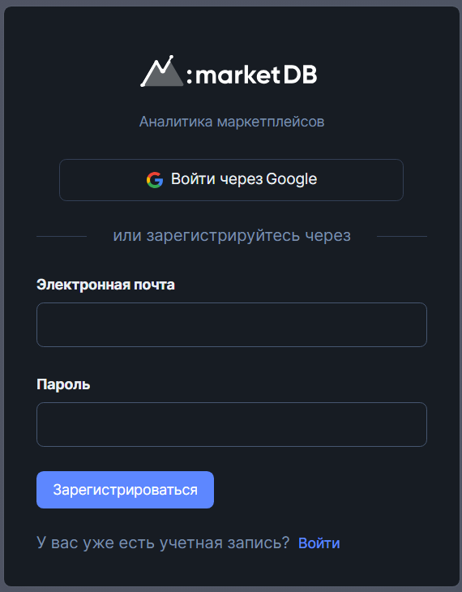

# Начало работы с MarketDB

**_MarketDB_** - сервис аналитики маркетплейсов Магнит Маркет и Uzum.

## Шаг 1: Регистрация

Перед началом использования сервиса необходимо [создать аккаунт](https://space.marketdb.pro/auth/register) и/или войти в [Личный кабинет.](https://space.marketdb.pro/auth/login)

  

## Шаг 2: Выбор и оплата тарифа

Для профессионального использования мы предлагаем ряд тарифов на 1 или 3 месяца. При покупке на 3 месяца действует скидка.

Изучить и приобрести тарифы можно в [личном кабинете](https://space.marketdb.pro/pricing).



Для каждого маркетплейса тарифы покупаются отдельно. Нельзя купить тариф для Магнит Маркет и использовать для Uzum, в том числе наоборот.



Маркетплейс необходимо выбрать в левом контекстном меню под окошком "Баланс". 
Это необходимо, потому что оплата проходит **ТОЛЬКО по выбранному маркетплейсу**. 
Оба маркетплейса оплатить сразу нельзя

  

Для оплаты тарифа необходимо нажать кнопку "Выбрать". После появится меню с информацией об оплате, в котором вы увидете сумму, выбранный тариф, селектор с платежными системами и поле ввода промокода для скидки, если такой у вас есть.
По умолчанию установлена рекомендованная нами платежная система, но ее можно изменить.

  

При нажатии кнопки "Оплатить тариф" вы будете перемещены на сайт платежной системы.



Внимательно следуйте инструкциям при проведении оплат! 
Если сказано, что оплату необходимо провести ОДНИМ платежом, то строго соблюдайте это.
Если сказано, оплатить КОНКРЕТНУЮ сумму, то оплачивать нужно ЧЕТКО указанную - ни больше, ни меньше.



## Шаг 3: Внутренняя аналитика в ЛК

Для работы с внутренней аналитикой необходимо в Личном кабинете открыть раздел ["Аналитика"](https://space.marketdb.pro/analytics/categories).

В данном разделе вы увидите список категорий выбранного маркетплейса в виде таблицы с аналитическими данными.
Категорию можно развернуть нажатием на "+", чтобы увидеть подкатегории. 

  

Так же при нажатии на название категории вы перейдёте на страницу подробной аналитики по выбранной категории, где сможете посмотреть сводку или список продуктов.

  

  



Внутренняя аналитика доступна для маркетплейса в соответствие с тарифом. 



## Шаг 4: Внешняя аналитика на маркетплейса

Для работы с внешней аналитикой необходимо установить расширение и настроить его.

### Шаг 4.1: Установка расширения

Расширение поддерживается в: Google Chrome, Opera, Mozilla Firefox и Яндекс браузер.



Для каждого маркетплейса, [Магнит Маркет](https://marketdb.ru) или [Uzum](https://marketdb.org) свое расширение.
* [Расширение Магнит Маркет](https://chrome.google.com/webstore/detail/marketdb-%D0%B0%D0%BD%D0%B0%D0%BB%D0%B8%D1%82%D0%B8%D0%BA%D0%B0-kazane/cfkfachbapidmnjkcandfhlbnfiialei?hl=ru)
* [Расширение Uzum](https://chrome.google.com/webstore/detail/marketdb-%D0%B0%D0%BD%D0%B0%D0%BB%D0%B8%D1%82%D0%B8%D0%BA%D0%B0-uzumuz/blgbandfopjlfnfpgknfmdkboekolpcc?hl=ru)



После установки расширение в Вашем браузере в разделе управления расширениями появится иконка MarketDB.

  

  

### Шаг 4.2: Генерация токена

После приобретения тарифа необходимо [сгенерировать токен](https://space.marketdb.pro/extension) доступа в Личном кабинете во вкладке "Аналитика" -> "Расширение" и вставить его в окно расширения.

  

### Шаг 4.3: Настройка расширения

Для настройки расширения первым делом необходимо вставить в расширении в поле "Токен" сгенерированный ранее токен. Чтобы скопировать токен из Личного кабинета, достаточно кликнуть по нему и он скопируется автоматически.

В поле "Токен" вставьте скопированный токен и нажмите галочку, после чего в расширении откроются доступные для Вашего тарифа периоды.

  

#### Шаг 4.4: Использование

Последним шагом Вам осталось открыть интересующий Вас маркетплейс, где уже автоматически подключиться аналитика, благодаря который Вы повысите свои продажи!



На данный момент мы работает с двумя маркетплейсами:
* [Магнит Маркет](https://mm.ru/)
* [Uzum](https://uzum.uz/ru)



  

  

