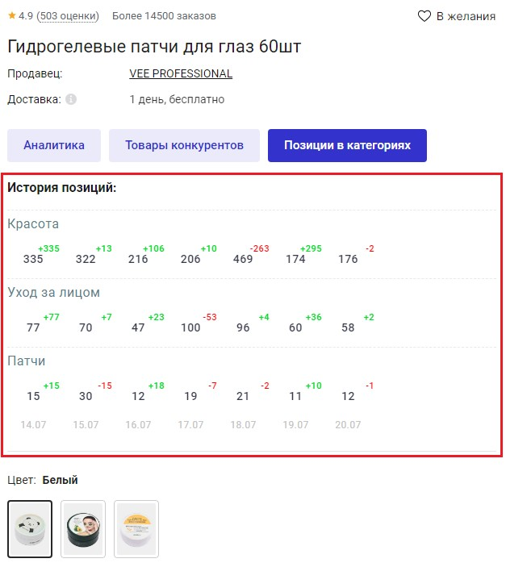

# Возможности сервиса



Раздел в разработке



В данном разделе Вы узнаете обо всех функциях и возможностях MarketDB.

## Внутренняя аналитика
Аналитика в Личном кабинете MarketDB.

### Аналитика категорий
В Личном кабинете в [разделе Аналитика](https://space.marketdb.pro/analytics/categories) доступна аналитическая сводка по каждой категории.
Аналитические данные отображаются для маркетплейса в соответствии с Вашим тарифом. 
В данном разделе показаны:
* основные категории; 
* маркетплейс, который относится к данной категории;
* выручка категории;
* продажи по категории;
* средний чек;
* и др.

Так же по каждому показателю доступна сортировка и сортировка по периодам.

  

Категорию можно раскрыть, нажав на "+", чтобы посмотреть подкатегории и их аналитику.
Углубляться можно до 5 подкатегорий.

  

### Продукты категории
Если нажать на название категории, то попадете в раздел с продуктами данной категории.
По каждому продукту доступны основные аналитические показатели.

В разделе доступны фильтрация и сортировка, а так же возможность перейти в категорию на самом маркетплейсе.

  

Более подробную информацию по продукту Вы сможете узнать, нажав на его название.

  

## Внешняя аналитика
Аналитика на основе расширения для браузера

### Аналитика каталога
В каталоге для каждого товара доступна базовая аналитика: количество продаж, выручка, среднее количество продаж за выбранный период, название продающего магазина.

  

### Аналитика карточки
В карточке товара доступны три категории аналитики: Аналитика, Товары конкурентов, Позиция в категориях.

  

### Аналитика
Данная категория содержит общую статистику по продукту за выбранный период в виде цифр (кол-во продаж, выручка, среднее кол-во продаж) и по суточных графиков (кол-во продаж, цена, остатки).

  

### Товары конкурентов
Наши алгоритмы подберут возможные товары ваших конкурентов.

  

### Позиция в категориях
Вы сможете посмотреть динамику вашего товара в продающихся категориях за последние 7 дней.
Где число черным цветом показывает текущую позицию в категории. Число зеленого цвета с плюсом означает, что товар поднялся на данное количество позиций выше, красного цвета с минусом - опустился.

  

### Отчеты
Вы можете сформировать Excel отчеты по выбранному магазину и/или по выбранной категории за выбранный период, доступный в рамках вашего тарифа.

Для формирования отчета:
- **по категории** - откройте интересующую вас категорию и рядом с её названием увидете кнопку "Скачать отчет";
- **по магазину** - откройте интересующий вас магазин и рядом с его названием увидете кнопку "Скачать отчет".

> Скачать пример отчета: [по магазинам](https://docs.google.com/spreadsheets/d/18ObHGlw3jSm800MEvqpf169mpfP7m3kZ/edit?usp=sharing&ouid=111525418671232592177&rtpof=true&sd=true), [по категории](https://docs.google.com/spreadsheets/d/1cmBXNJ1pMFI9AFOPfwzMalA8Ui5GeMcW/edit?usp=sharing&ouid=111525418671232592177&rtpof=true&sd=true).

